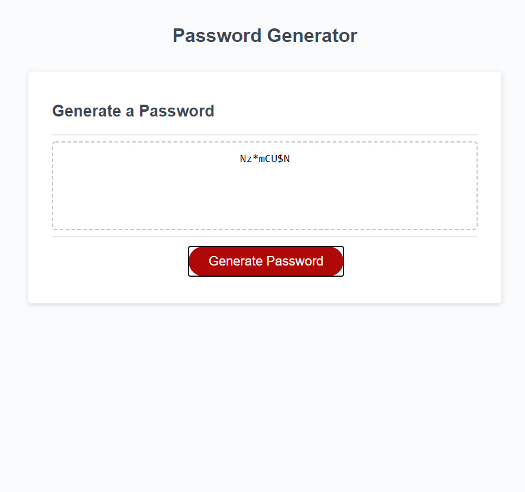

# JS-password-Generator

## Overview
Password generator writen in Javascript. 

## how to use it?

- open index.html
- click on generate password 
- select how many characters you need. (mininum 8, maximum 128)
- select type of characters you need. ( special characters, numbers, letters)
- done

